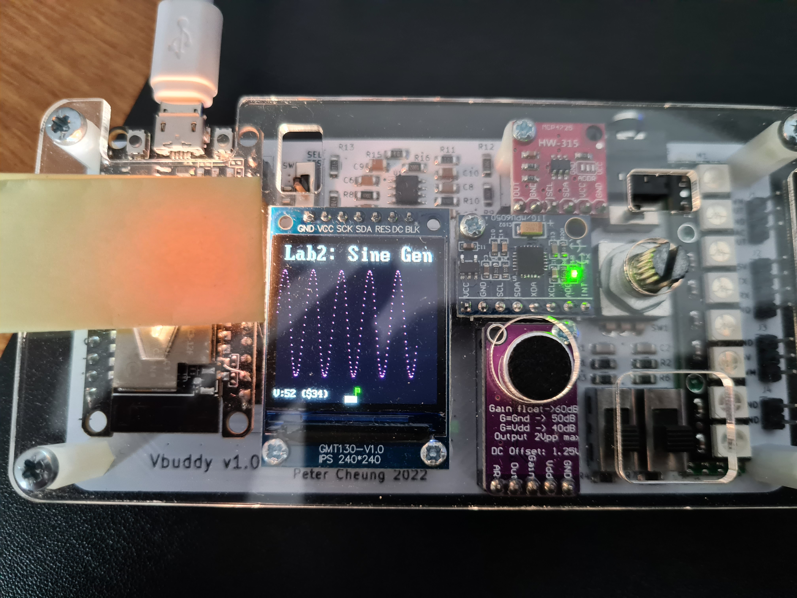
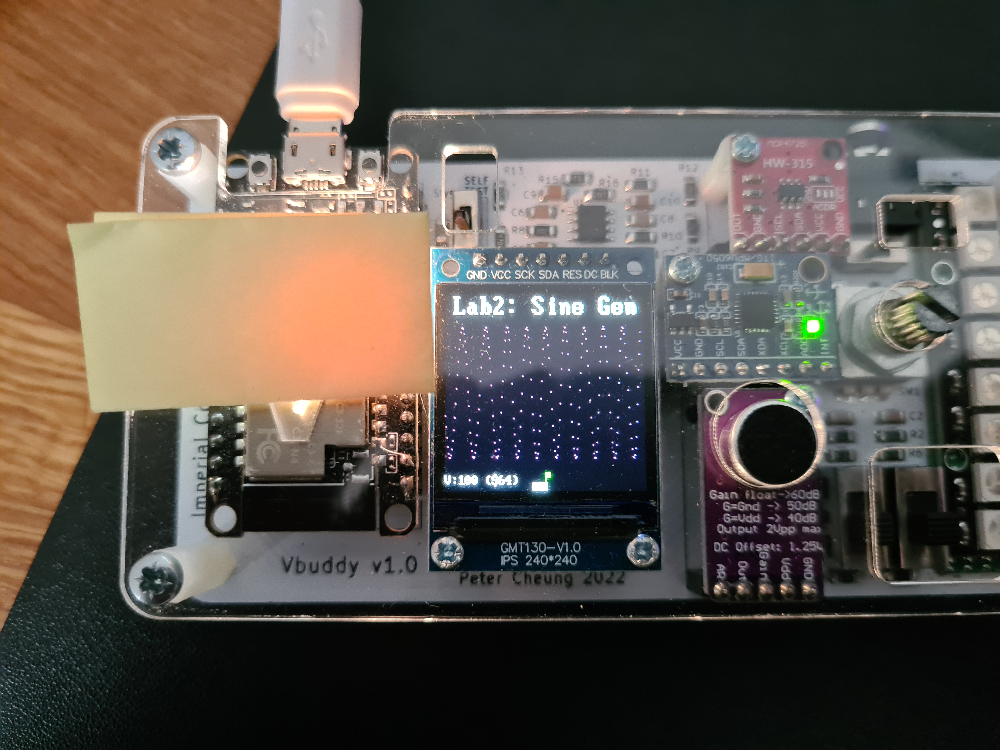

# Task 1

The image below shows the signal stored in the ROM being displayed:

To increase the frequency of the signal, values must be skipped for every clock cycle, this is equivilent to increasing the arguement in a sine function -> as for the same increment of time, increasing the argument causes it to skip values. Since the argument is increased, this is equivilent to increasing the frequnency. 

At a higher frequency:

At the highest frequency:

The signal becomes less smooth, looking more like it is made up of dots due to the fact that it is skipping values, since it misses the values inbetween the dots, it leaves a large gap between them, which widens as frequency increases.