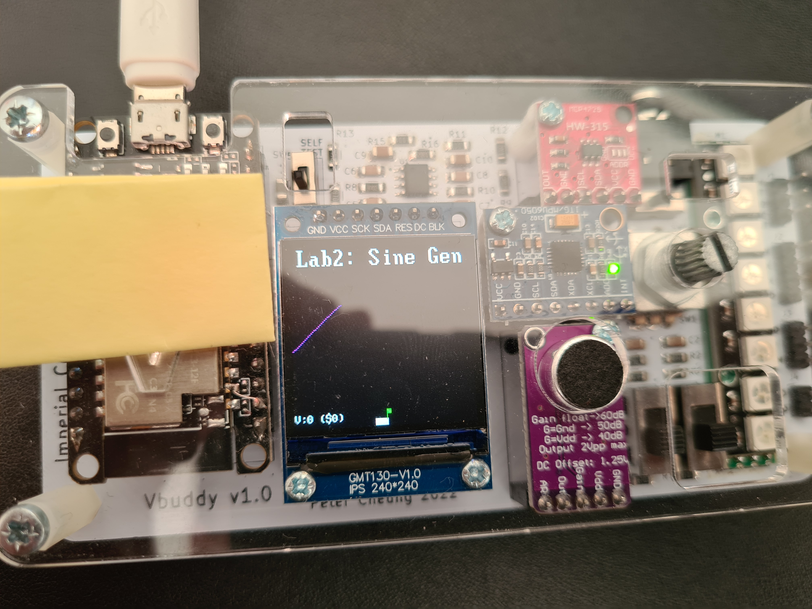
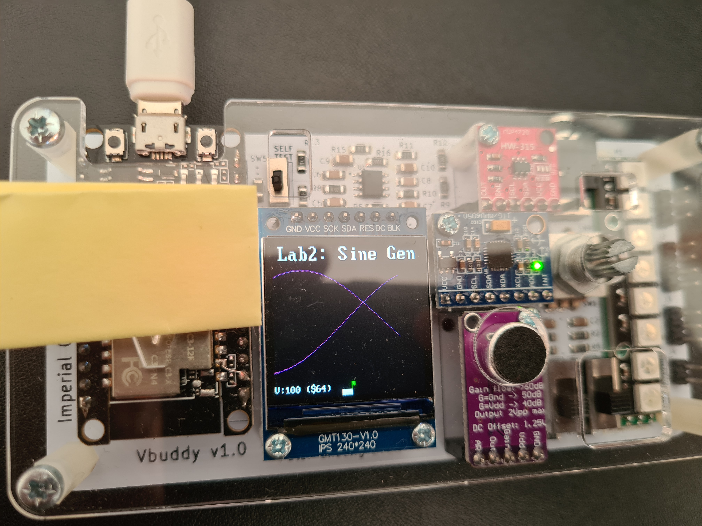

# Task 2

- ROM is made dual port - with to address inputs and 2 outputs
- offset input created on top level sinegen compoent
- offset takes value of potentiometer
- this offset value is added to the other address being read from - to produce a delay

When offset = 0 -> both reading the same value

When offset = 0x64 -> 90degrees out of phase
