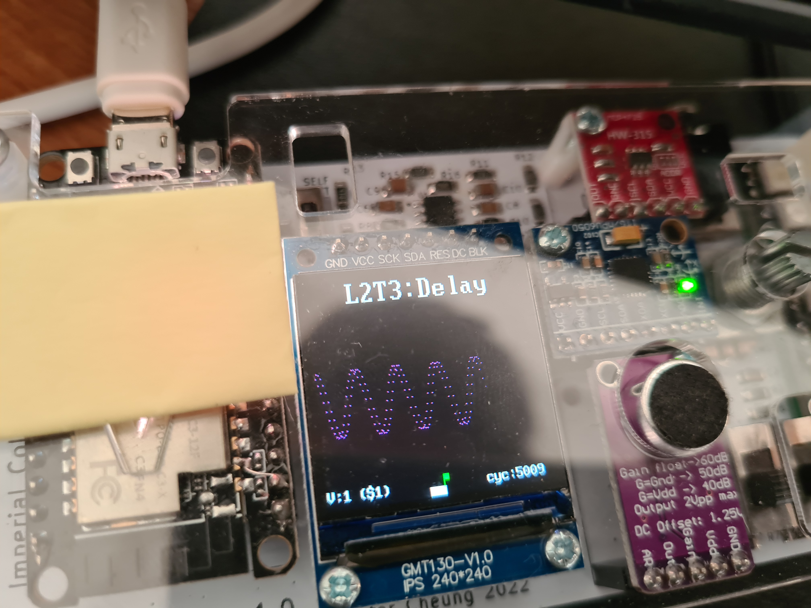
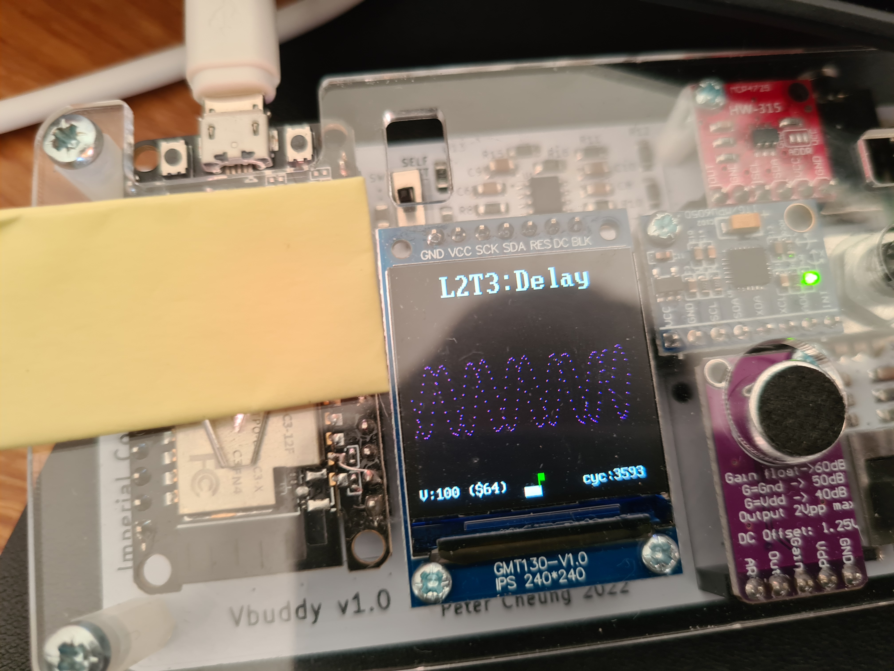
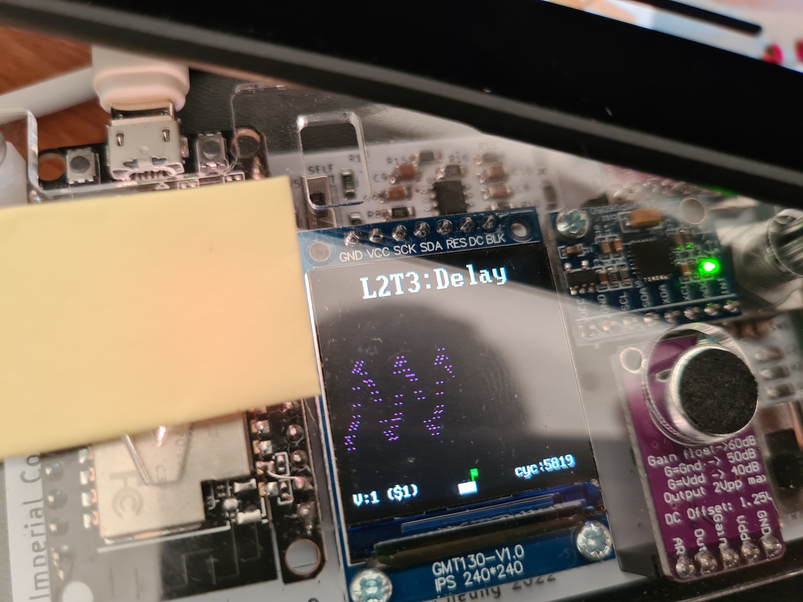
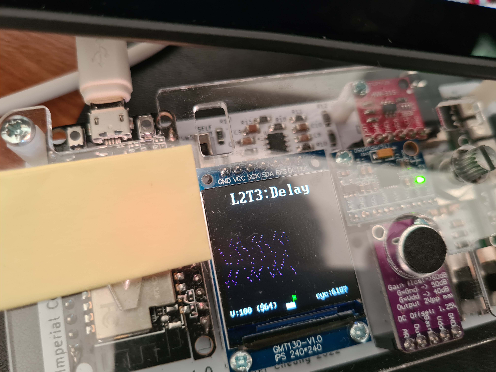

# Task 3

- required creating dual port RAM, that could read from 1 address and write to the other
- the offset input into the sinegen component is taken away to look at the previous addresses - to find the previous signal value which have been written to

when the offset is 1 -> you get the shortest offset possible - an address before the one written to
When the offset is 0 -> the register has not been written to therefore it has a random value

The image below shows a sine wave:

With offset 1:

With highest offset value possible:

The image below shows a triangle wave:

with offset 1:

With highest offset value possible:

The triangle wave does not produce one clearly, this could be since some frequencies are being filtered out.